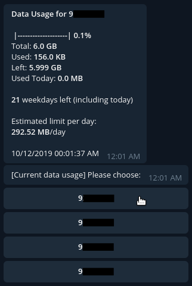

# StarHub Telegram Bot (Python)

## Why?

I created this bot back when the old StarHub app was horrible. Navigating to the data usage page takes a few taps and
every movement was being tracked (analytics).

Since I spend more time on Telegram, why not create a bot that simplifies the experience of retrieving that information?



## Documentation

- [StarHub Endpoints](docs/endpoints.md)
    - [December 2019 Changes](docs/starhub_2019_changes.md)
- [Encryption Algorithm (WIP)](docs/encryption-algorithm.md)

## Deployment

### Build Docker Image

```bash
docker build -t starhub-tg-bot .
```

#### Docker: Remove intermediate stage images

Reason why there is a intermediate stage is because of the attempt to reduce the
final image size of the bot by using the Python-Slim image instead of the full Python
image.

[Building Minimal Docker Containers for Python Applications](https://blog.realkinetic.com/building-minimal-docker-containers-for-python-applications-37d0272c52f3)

See: https://github.com/moby/moby/issues/34513

```bash
docker image prune --filter label=stage=removeme
```

### Run Docker Image

https://github.com/moby/moby/issues/4830#issuecomment-264366876

```bash
docker run -d --name starhub-bot -v `pwd`/config:/app/config:ro starhub-tg-bot
```

```bash
docker run -d --name starhub-bot -v `pwd`/config:/app/config:ro starhub-tg-bot && docker logs -f starhub-bot
```

```bash
docker run -d --rm --name starhub-bot -v `pwd`/config:/app/config:ro starhub-tg-bot && docker logs -f starhub-bot
```

## Development

I am currently using Pipenv to manage the packages required for this project.

Follow [this guide](https://pipenv-fork.readthedocs.io/en/latest/install.html#installing-pipenv)
to install Pipenv.

To install all the required packages from Pipfile:

```bash
pipenv install
```

To activate a shell with all the packages:

```bash
pipenv shell
```

To run the bot:

```bash
python3 /src/starhub_bot.py
```