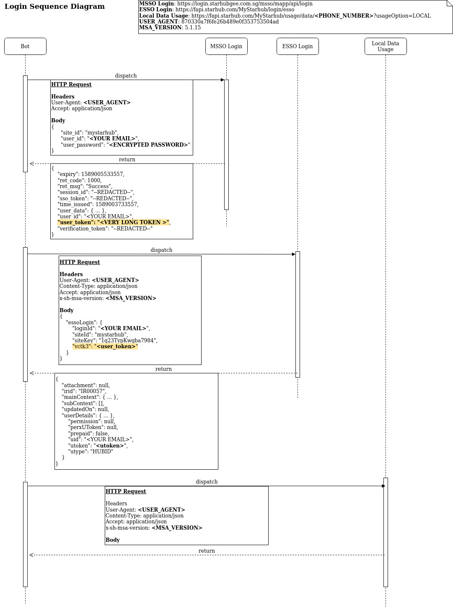

# StarHub Application Endpoints

- https://login.starhubgee.com.sg/msso/mapp/api/login (a.k.a MSSO)
  - Initial endpoint to retrieve `user_token`
- https://fapi.starhub.com/MyStarhub/login/esso (a.k.a ESSO)
  - Endpoint to retrieve `utoken`
- https://fapi.starhub.com/MyStarhub/usage?type=local
  - Retrieve all usage (SMS/Voice/Data) for all numbers
- https://fapi.starhub.com/MyStarhub/usage/data/{phone_number}?type=LOCAL
  - Retrieve data usage for a specific `phone_number`

## Updates

[December 2019 endpoint update (link to markdown file)](starhub_2019_changes.md)

## Note: HTTP Headers

StarHub's endpoints require a specific `User-Agent` and `x-sh-msa-version` value.
If the values are outdated/incorrect/missing, the endpoint might not work or would
return an `Internal Server Error`.

Currently the `User-Agent` is `870330a7f6fe26b489e0f353753504ad`
and the `x-sh-msa-version` is `5.1.15`.

## Authentication Sequence

After some trial and errors the authentication flow is structured as such:

1) https://login.starhubgee.com.sg/msso/mapp/api/login (a.k.a MSSO)
    - Retrieve `user_token` from response (see MSSO Login reference)
    - Even though the payload contains a `expiry` field, it seems like the **user_token` can still be used even after it is expired**
2) https://fapi.starhub.com/MyStarhub/login/esso (a.k.a ESSO)
    - Using `user_token` retrieve `utoken` from response (see ESSO Login reference)



## Endpoint Reference

### MSSO Login

* **URL**

  https://login.starhubgee.com.sg/msso/mapp/api/login

* **Method:**

  `POST`
  
*  **Headers**

    'User-Agent': '870330a7f6fe26b489e0f353753504ad'

* **Data Params**

  JSON

    ```json
    {
      "site_id": "mystarhub",
      "user_id": "---REDACTED---@yourmail.com",
      "user_password": "---REDACTED---"
    }
    ```

* **Success Response:**

  * **Code:** 200 <br />
    **Content:** JSON

    ```json
    {
        "expiry": 1529138910047,
        "ret_code": 1000,
        "ret_msg": "Success",
        "session_id": "---REDACTED---",
        "sso_token": "---REDACTED---",
        "time_issued": 1529137110047,
        "user_data": {
            "dob": "---REDACTED---",
            "email": "---REDACTED---@yourmail.com",
            "gender": "---REDACTED---",
            "name": "---REDACTED---",
            "nick_name": "null",
            "status": "bill_associated",
            "uuid": "---REDACTED---@yourmail.com"
        },
        "user_id": "---REDACTED---@yourmail.com",
        "user_token": "---REDACTED---"
    }
    ```
    
### ESSO Login

* **URL**

  https://fapi.starhub.com/MyStarhub/login/esso

* **Method:**

  `POST`
  
*  **Headers**
  
    'User-Agent': '870330a7f6fe26b489e0f353753504ad'

* **Data Params**

  JSON

    ```json
    {
        "essoLogin": {
            "loginId": "---REDACTED---@yourmail.com",
            "siteId": "mystarhub",
            "siteKey": "1q23TypKwgba7984",
            "vctk3": "---REDACTED---"
        }
    }
    ```

* **Success Response:**

  * **Code:** 200 <br />
  * **Content:** JSON

    ```xml
    {
        "attachment": null,
        "irid": "IR00057",
        "mainContext": { ... },
        "subContext": [],
        "updatedOn": null,
        "userDetails": { ... },
            "permission": null,
            "perxUToken": null,
            "prepaid": false,
            "uid": "---REDACTED---@yourmail.com",
            "utoken": "---REDACTED---",
            "utype": "HUBID"
        }
    }
    ```

### Data Endpoint

* **URL**

  https://fapi.starhub.com/MyStarhub/usage?type=local
  https://fapi.starhub.com/MyStarhub/usage/data/{phone_number}?type=LOCAL

* **Method:**

  `POST`
  
*  **Headers**

    'Authorization': `{utoken}`

    'User-Agent': '870330a7f6fe26b489e0f353753504ad'

    'x-sh-msa-version: '5.1.15'

    'Content-Type': 'application/json'

    'Accept': 'application/json'

* **Query Params**

    'phone_number': Singapore phone number under StarHub

* **Success Response:**

  * **Code:** 200
  * **Content:** JSON

## Tools Used

[mitmproxy (mitmweb)](https://mitmproxy.org/) was used to capture and inspect the network requests made by the mobile application

Guide for setting up mitmproxy with an iOS device: https://jasdev.me/intercepting-ios-traffic

> Note: For iOS devices, an additional step is required: https://docs.mitmproxy.org/stable/concepts-certificates/#installing-the-mitmproxy-ca-certificate-manually